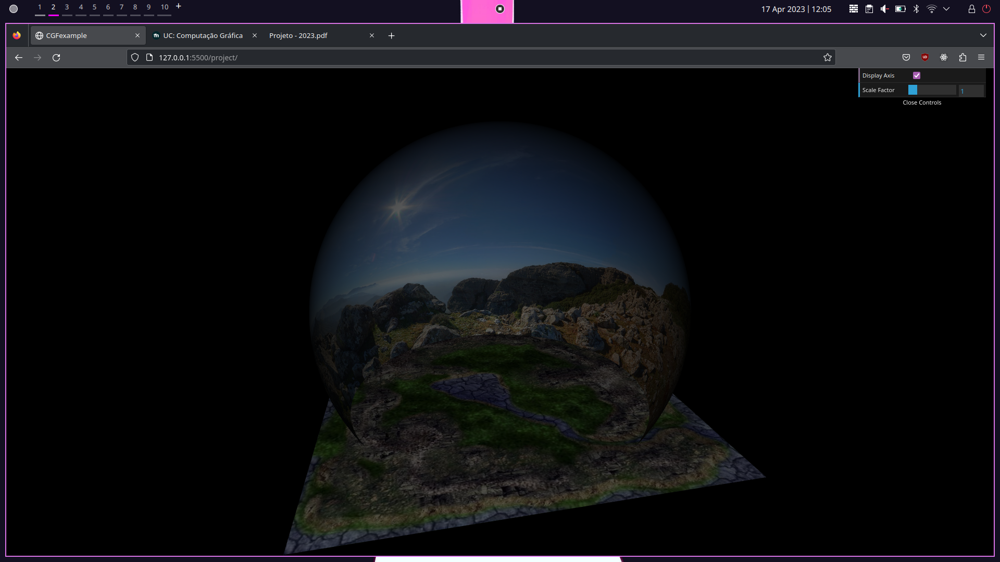
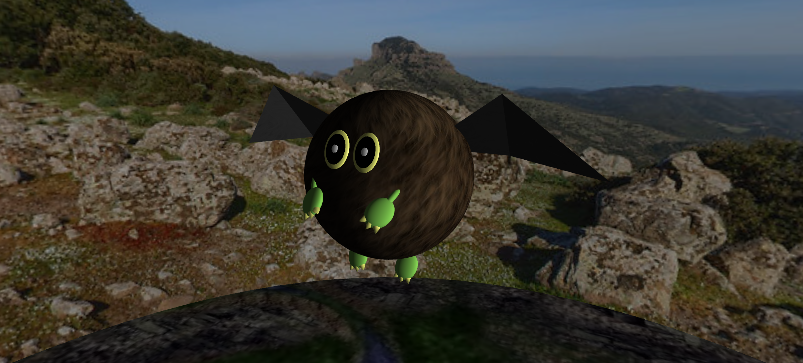
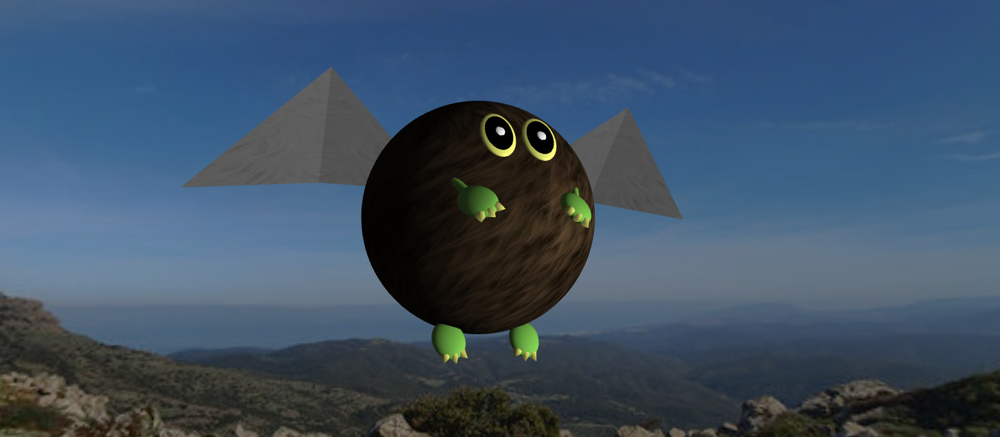
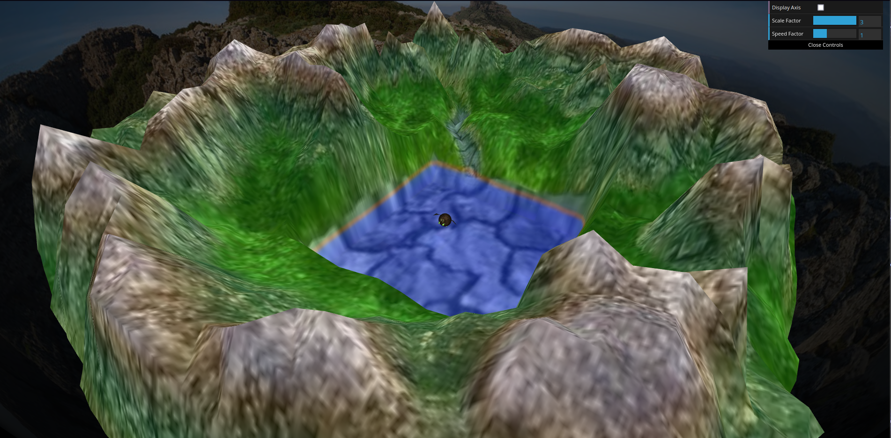
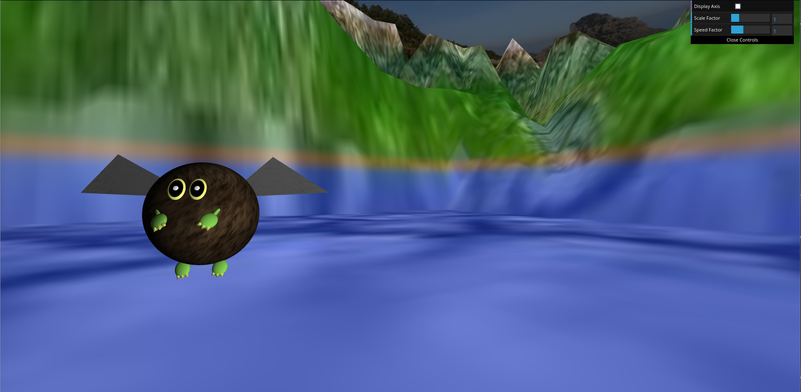
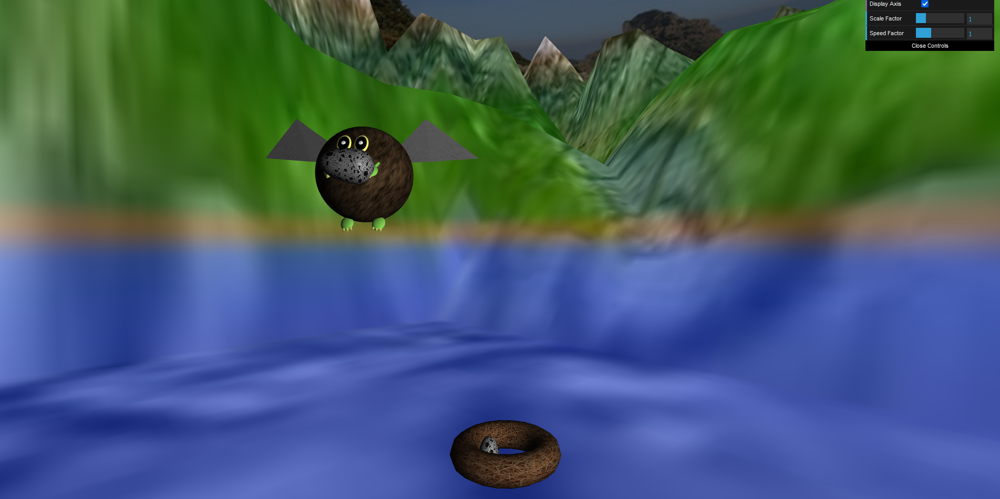
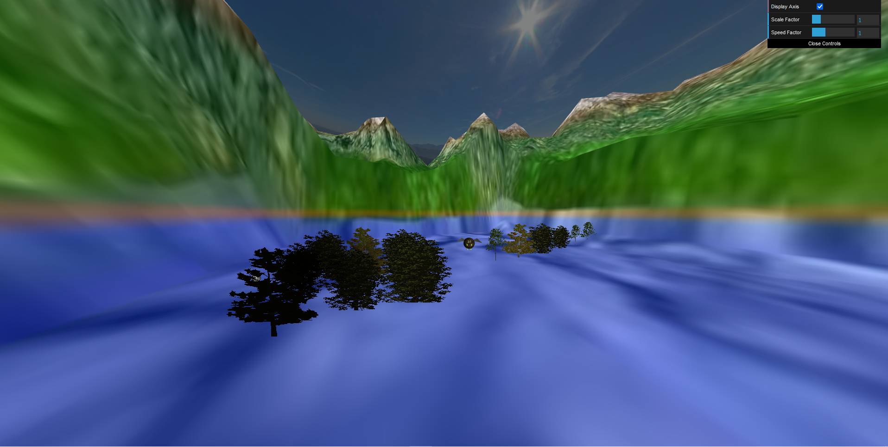
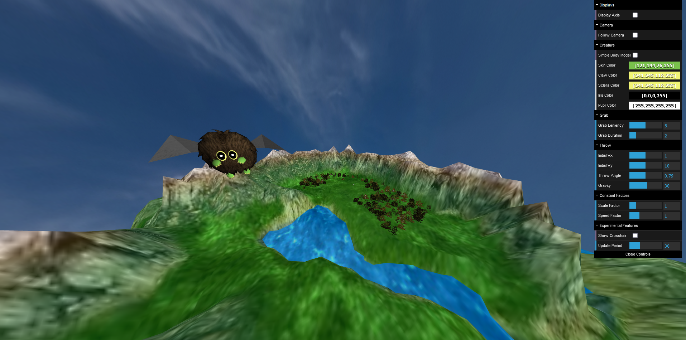

# CG 22/23

## Main features implemented
- Parametrizable sphere primitive (1)
- Panorama (2)
- Animated and controllable flying creature (3)
- Terrain with bump map and altimetry, modified using shaders (4)
- Nest and egg  objects, the latter of which are able to be picked up and thrown by the creature (5)
- Tree objects facing the direction of the camera, individually or in groups (6)

## Additional features
- Parametrizable parabola trajectory of thrown eggs (7)
- Crosshair that shows where the egg will land if thrown at any given moment
- Animated water shader
- Various GUI controls:
    - Third-person creature camera
    - Creature body model (simple/elaborate)
    - Creature scale and general speed factor
    - Color of certain creature body parts
    - Egg pickup/nest area leniency and pickup motion duration
    - Egg throw motion variables: initial velocity in X and Y axes, throwing angle and gravity force
    - Update period
    - Crosshair display

## Development notes
- The primitive used for the nest (a Torus) is adapted from the [Torus object](https://github.com/mrdoob/three.js/blob/master/src/geometries/TorusGeometry.js) provided by three.js, a Javascript library for 3D graphics. Its code is very well-structured and easy to understand, and because of that we decided to use it in our project.
- The more elaborate body used for the creature was taken from [this website](https://www.models-resource.com/3ds/yugiohduelmonsterssaikyocardbattle/model/17475/?source=genre). The simple spherical body was the weakest link of our recreation of the original creature ([Winged Kuriboh](https://www.db.yugioh-card.com/yugiohdb/card_search.action?ope=2&cid=6314)), so we imported a model that turned the creature appearence's greatest flaw into its biggest strength.

## Development screenshots

### 1- Panorama

### 2- Creature

### 3- Terrain

### 4- Eggs and Nest

### 5- Trees

### 6- Final Project
