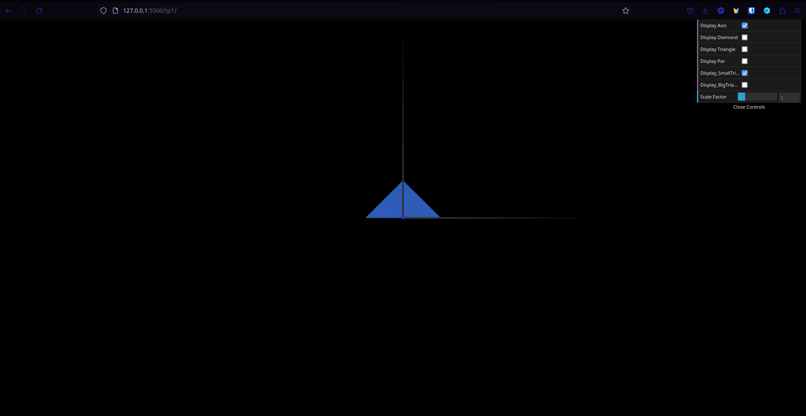
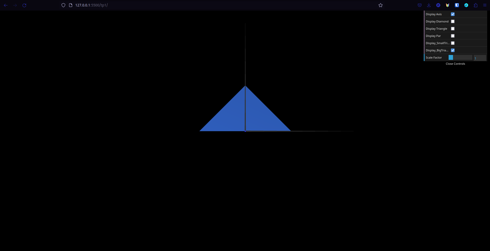

# CG 2022/2023

## Group T10G02

## TP 1 Notes

- Calling the display function of an object between the axis display function and the `setDefaultAppearance()`call causes that object to become green instead of blue. Our guess is that the Y axis (green) is the last one rendered in the CGFAxis object, and every other object created after that will inherit that color, unless the apparance is reset to its default value. In fact, changing the rendering order of the axes inside the CGF.js file also affects the color of that object.
- While creating the parallelogram, we initially thought of using 4 different triangles (2 triangles on each side of a square in the middle, which requires 2 triangles to draw), but then we realized that only two bigger triangles were needed.

