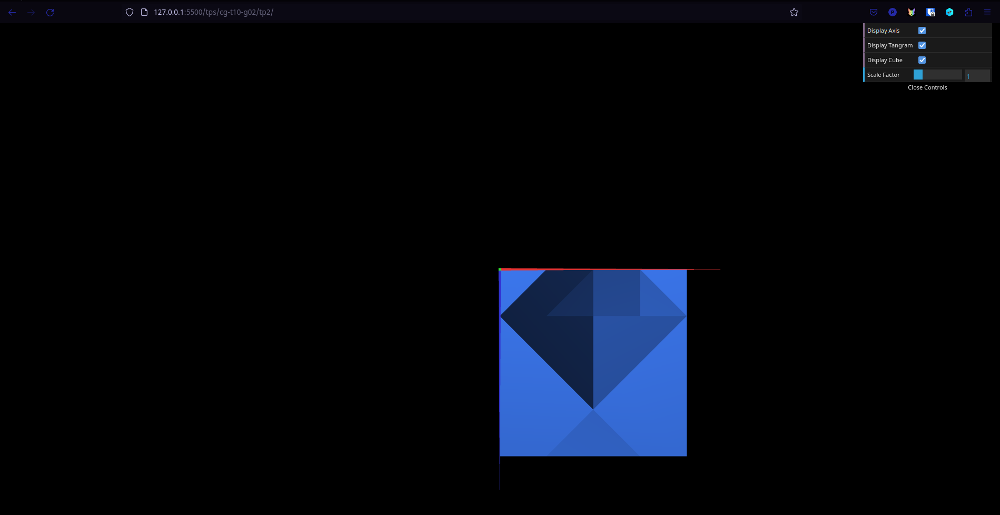
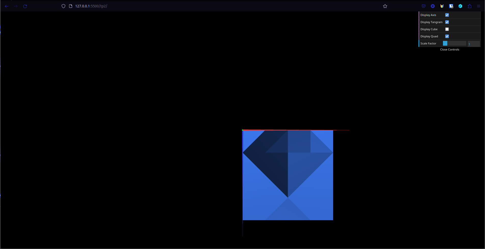

# CG 2022/2023

## Group T10G02

## TP 2 Notes

- In order to correctly replicate the diamond shape we had to alter our `Parallelogram`, as the bottom right vertex had to be aligned with the top left one, which was not required for the previous exercises.
- We noticed that the lighting between the two cubes (ex.3 and ex.4) was different, in the sense that the ex.3 cube seems like it is affected by lighting evenly across all sides, given an observation point. We believe this happens because the first cube is being treated as a single 2D object that "bends" to form a cube, whilst the second cube is a combination of multiple 2D surfaces.

