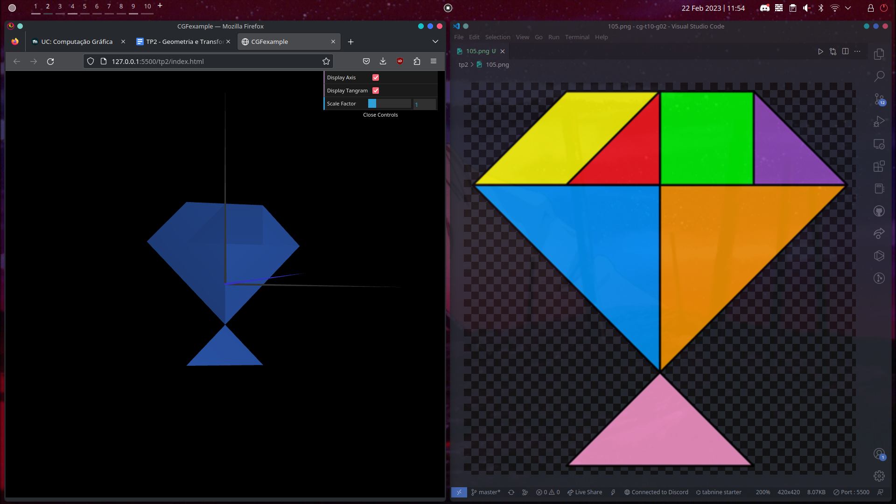

# CG 2022/2023

## Group T10G02

## TP 2 Notes

- In order to correctly replicate the diamond shape we had to alter our `Parallelogram`, as the bottom right vertex had to be aligned with the top left one, which was not required for the previous exercises.
- GCFscene

