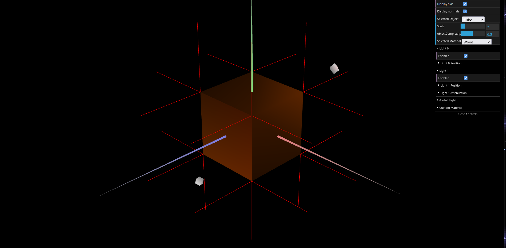
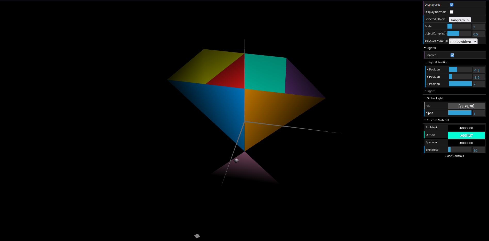
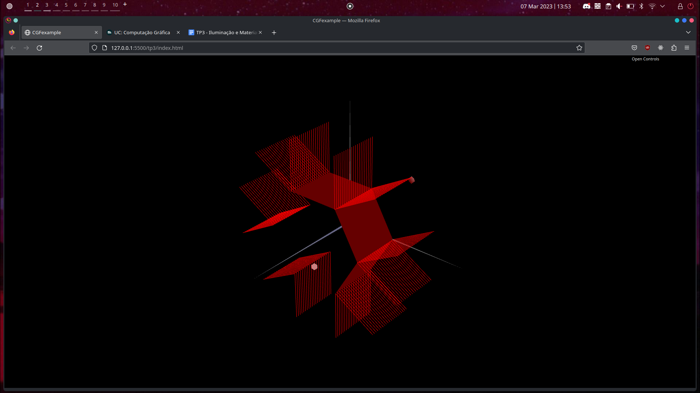
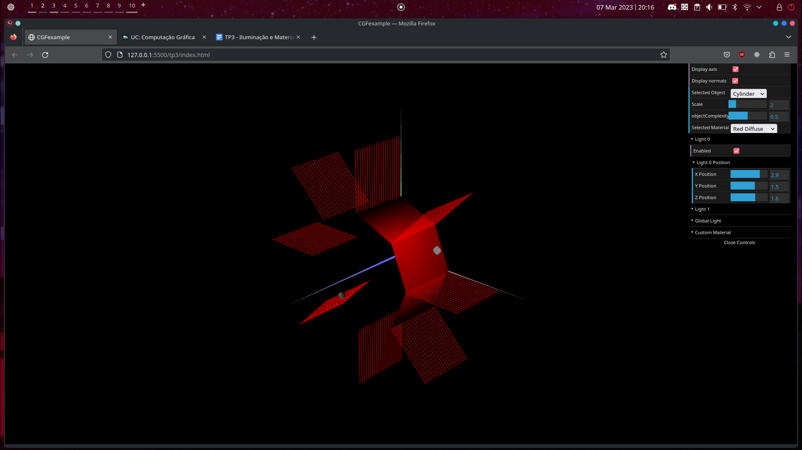

# CG 2022/2023

## Group T10G02

## TP 3 Notes

- Having to clone the vertices according to the number of sides they are a part of in order to attribute the corresponding normal vector to them feels unintuitive, but understandable when taking the illumination procedure from WebGL into account.
- The `hexToRgbA()` function was invaluable to replicate the Tangram, as converting the colors from the image to the program manually would've been bothersome.

- Exercise 2 was one of the most challenging exercises yet. Generating the vertices was not easy at first, nor was finding the formula for the indices, but eventually we found out through constant experimentation.

- When using diffuse or specular materials and an appropriate light source, we can accomplish the illusion of a round surface as seen in the screenshot, which only increases in quality as we add more slices and stacks.

