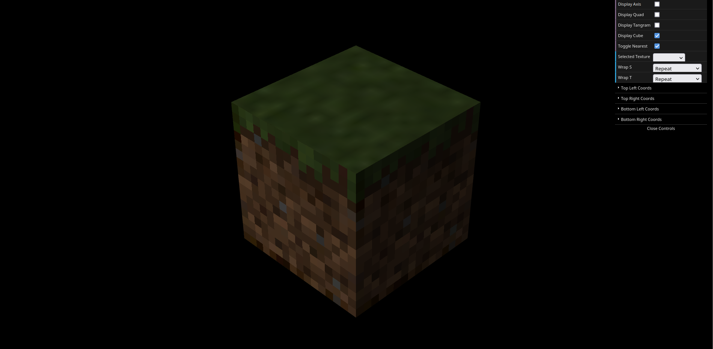

# CG 2022/2023

## Group T10G02

## TP 4 Notes

- We had to change the `MyTriangle` class to complete this exercise. Since we used the same object displayed multiple times to create different triangles for the tangram, we changed the class so that we could pass the `texCoords` as parameter. Then, we had to create copies of the triangle object for each unique triangle, passing the adequate `texCoords`.

- We added a strong global lighting to the scene, since the +X side of the cube was very dark when viewing the application through the camera's default position. We also implemented the checkbox to alternate between Linear and Nearest filtering, as seen in the screenshot below.

