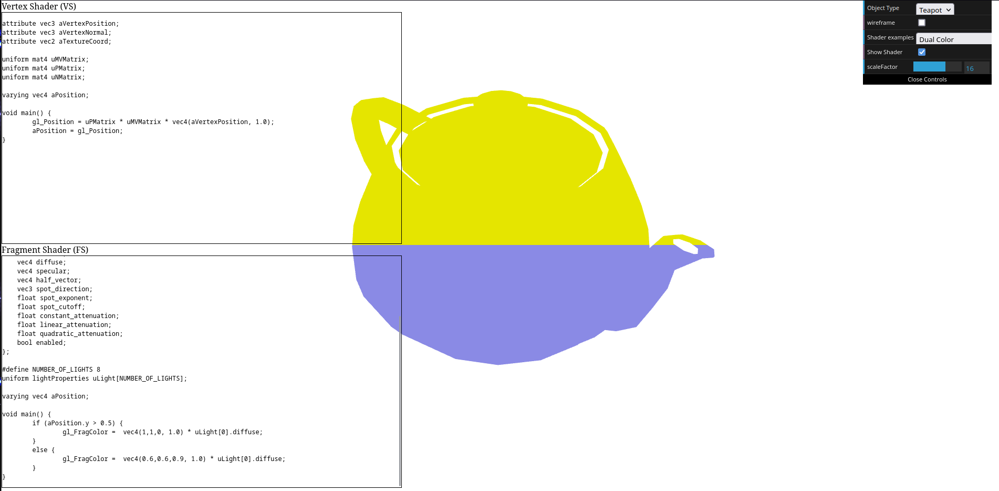
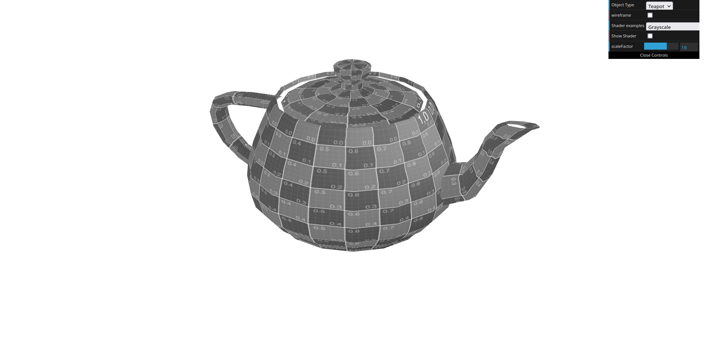
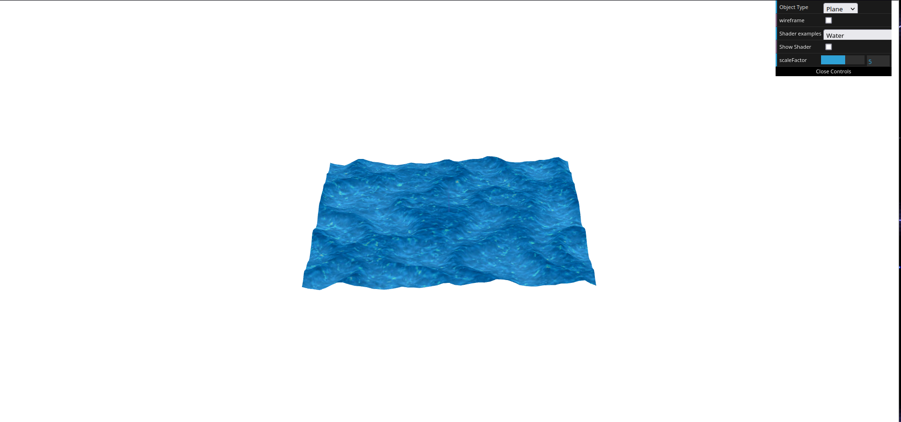

# CG 2022/2023

## Group T10G02

## TP 5 Notes

- The third exercise was a bit more complex than the other two, but overall it was an interesting TP. Some aspects had to be tuned in relation to the source code, such as the if clause present in the animated shader: `if (filter.b > 0.5)`. This clause couldn't be present in the .frag file of the exercise 3 shader, since the waves would only change color in more pronounced variations of the map texture, causing an unrealistic wave effect. Moreover, although not totally necessary, we used a different map texture, since the provided one wasn't fully seamless.

Dual color teapot

Grayscale teapot

Wave
